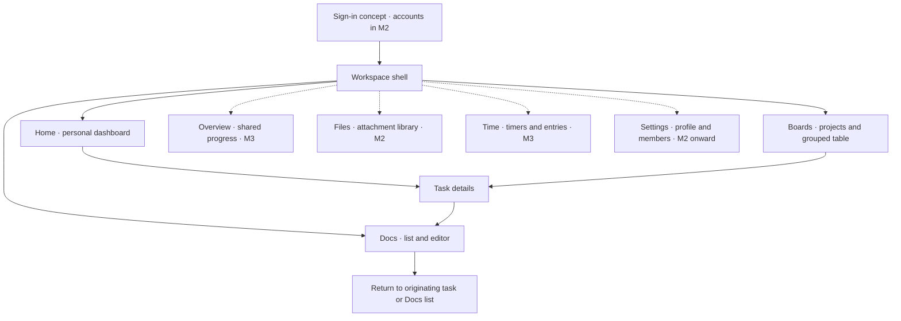

# Workspace app — screen map and design brief

**M1.1 · Planning deliverable · 25 September 2026**

> This brief defines the first prototype's screens and interactions. It is not a running prototype. The user has selected a dark workspace with subtle accents, equal desktop/phone emphasis, and larger controls. Exact colors, typography, dimensions, and interaction details remain provisional and can be refined through later design prompts. See [STATUS.md](STATUS.md) for current progress.

## 1. Direction at a glance

Create a shared working space where four collaborators can find today's work, update projects, and write together without leaving the app. Use the familiar board/table organization requested by the user, with personal Home screens and shared project records.

| Decision | Current direction | Authority |
| --- | --- | --- |
| Product structure | Monday-style boards, task details, dashboards, and embedded Docs | Confirmed conversation scope |
| Accounts | Individual password-protected accounts; personal dashboard for each collaborator | Confirmed; authentication arrives in M2 |
| Shared work | One shared workspace initially; personal Home filters shared tasks | Confirmed baseline; private personal workspaces excluded |
| Visual direction | Dark workspace with subtle accents and labelled status colors | User selected during M1.1; exact palette remains provisional |
| Controls and density | Larger controls, comfortable rows, and clear spacing | User selected larger controls; exact dimensions remain provisional |
| Device priority | Equal desktop and phone focus, including task work and document writing | User selected during M1.1; adapt layout to each screen |
| Name | “Workspace” as a temporary label | Placeholder; final name open |
| Data location | NAS for application data, attachments, and collaborative document content | Confirmed architecture constraint |

No cloud document account is part of the intended editing journey. Storage technology, server health, and memory details belong in administration and operating documentation, not everyday task screens.

## 2. Screen map

The same app shell connects all sections. Solid paths below identify the first prototype journey; dotted paths identify mapped sections whose working features arrive later.



**Text equivalent:** sign in to enter the workspace, land on personal Home, open a project board or an assigned task, then open a linked document. Home, Boards, and Docs remain directly reachable through the sidebar. Overview, Files, Time, and Settings have defined locations but are implemented in later milestones.

### Screen inventory and delivery boundaries

Paths are proposed navigation identifiers, not existing pages or a locked routing implementation.

| Screen | Purpose and primary action | Proposed location | First prototype coverage | Working feature |
| --- | --- | --- | --- | --- |
| Sign in | Enter your account and continue to Home | `/sign-in` | Journey concept only; no credential form required | M2.2 |
| Home / My Day | Find and open assigned work due now or next | `/home` | Sample task sections and recent documents | M1.3 sample; M3.4 live |
| Boards | Find a project and open its board | `/boards` | Small sample project list | M1.4 sample; M2.4 saved |
| Selected board | Read grouped tasks; add/edit/filter a task | `/boards/:boardId` | Grouped table and local sample interactions | M1.4 sample; M2.4–M2.6 saved |
| Task details | Inspect and update one task | Panel over its origin; direct task link later | Sample fields, notes, checklist, linked Doc | M1.5 sample; M2–M4 by feature |
| Docs | Find a document and write inside the workspace | `/docs` and `/docs/:documentId` | Sample list, editor layout, local writing | M1.5 sample; M4.5–M4.6 saved/collaborative |
| Overview | Understand shared progress and workload | `/overview` | Labelled later section only | M3.4 |
| Files | Browse attachments and their related tasks | `/files` | Labelled later section; sample attachment names inside tasks | M2.7 |
| Time | Track time and review entries | `/time` | Labelled later section; no running timer | M3.5 |
| Settings | Manage profile, members, roles, and later rules | `/settings` | Labelled later section only | M2 accounts; M3 templates; M4 automations |

Use **Home** for “my work” and **Overview** for “our work.” Avoid a second top-level My Day page: My Day is the leading area of Home. Docs are shared documents, not private personal storage. Files is a library of app attachments, not a view of every folder on the NAS.

## 3. Layout and navigation

### Desktop structure

```text
┌──────────────────┬─────────────────────────────────────────┐
│ Workspace        │ Location / page title     Search  Profile│
│                  ├─────────────────────────────────────────┤
│ Home             │ Page heading + relevant main action     │
│ Boards           │ Views / filters when relevant           │
│ Overview · Later │                                         │
│ Docs             │ Working area                            │
│ Files · Later    │                                         │
│ Time · Later     │                                         │
│                  │                                         │
│ Settings · Later │                                         │
└──────────────────┴─────────────────────────────────────────┘
```

This is a structural wireframe, not a color or size commitment. Notifications join the top bar when that behavior is built. Search/Profile are planned shell positions; expose them as actionable controls only when their demonstrated behavior exists.

Provisional layout targets for M1.2:

- A sidebar around 220–240 px wide, with names beside icons and a clear active section.
- A top bar around 64–72 px tall with comfortably sized controls; search remains separate from board-specific filters.
- Main content uses available width. Avoid giant dashboard cards that push today's work below the first screen.
- A task panel around 400–460 px wide sits beside the board on a wide desktop. Keep a useful part of the board visible and preserve its position.
- At smaller widths, collapse navigation before crowding task content. If the board and task panel cannot both fit, show task details as a full-page view with a clear back action.

These are starting ranges to validate with real content, not a promise that one breakpoint fits every screen.

### Phone structure — an equal working surface

```text
┌──────────────────────────────┐
│ Menu     Page title   Account│
├──────────────────────────────┤
│ Page action / search         │
│                              │
│ Full-width task rows         │
│ Title, status, people, date  │
│                              │
├──────────────────────────────┤
│ Home        Boards      Docs │
└──────────────────────────────┘
```

Provisional phone navigation: a labelled three-item navigation bar for Home, Boards, and Docs; a menu contains the complete section list, including future areas. The menu and bottom bar share the same destinations and active state. Keep task creation, assignments, filtering, and document writing available on phones as their features arrive. Phone use is not limited to viewing or quick status changes.

Opening a task uses the full content area with a Back action. Opening a Doc prioritizes the writing surface and keeps its return action reachable. On-screen keyboards must not hide the active field or essential editor controls; allow the page to scroll and avoid overlays that cover the caret. The exact bottom-bar placement and keyboard behavior will be validated in the prototype.

### Navigation rules

1. Home is the normal landing page. The signed-in account determines its contents.
2. Sidebar choices move between sections; board view tabs stay within a single board.
3. Open a task from Home or Boards without losing the origin's filter, scroll position, or selection. Closing returns to that origin.
4. A linked document opens in the main workspace area, with **Back to task** when entered through a task. Keep the task's origin so returning again restores the board or Home.
5. A document entered directly from Docs uses **Back to Docs**. Do not invent a task association when none exists.
6. The document has one identity, even if several tasks link to it. Opening another link reaches that same document.
7. Prototype browser Back should match the visible back/close actions. No external tabs or Google Drive redirects are part of the main journey.
8. Future sections appear as clearly labelled **Later** items in the prototype shell, with visible explanatory text and no misleading active controls. Implemented sections become normal navigation links as they are delivered.

## 4. What each first-prototype screen contains

### Home — personal work first

Content order: page title and sample user → My Day (due today and overdue) → upcoming tasks → recent Docs. Show project name, status, and due date on task rows so cross-project lists make sense. Keep overdue work visibly distinct from upcoming work using text as well as color.

Primary action: open a task. Secondary action: open a recent document or its project. No dashboard customization controls are required; customizable widgets remain an open decision. Real notifications and tracked-time summaries join when their features exist.

Empty states: “No tasks due today” can coexist with upcoming work; a completely new collaborator sees “No tasks assigned yet” and a route to Boards. These are different situations.

### Boards — project list and working table

Board list: project name, a short description, and an action to open it. Selected board: project title → view navigation → task search/filters → collapsible groups → task rows → Add task.

Initial visible columns: **Task, Status, Assignees, Priority, Due date**. Show a modest indicator for subtasks or linked Docs where useful. Time tracking and configurable columns have reserved locations but become functional in their assigned increments.

Initial sample groups: **This week**, **Next**, **Completed**. Group membership and task status are separate concepts. Changing a status must not silently move a task to another group; that later behavior requires an explicit automation rule.

Primary action: Add task within a group. Row title opens details; clicking an editable field changes that field without also opening the panel. Prototype edits should immediately appear in other sample views that use the same task.

Only the Table view needs to work during M1. Kanban and Calendar can be visibly labelled as upcoming. If shown, they must not switch to a blank working-looking view.

### Task details — preserve context

```text
┌──────────────┬──────────────────────────┬──────────────────────┐
│ Navigation   │ Board stays visible      │ Task title      Close│
│              │ Group / task rows        │ Status · Assignees   │
│              │ Current selection        │ Priority · Due date  │
│              │                          │ Notes                │
│              │                          │ Subtasks / Checklist │
│              │                          │ Files / Linked Docs  │
└──────────────┴──────────────────────────┴──────────────────────┘
```

Use a single main detail column with related sections. Keep the title and key fields near the top. Distinguish subtasks (tasks with their own fields) from a checklist (small checked/unchecked steps).

Dependencies, time entries, and activity have defined future positions below task content; show them as planned only if necessary to explain the layout. Do not add a comment composer or @mention controls: those remain optional.

Use a visible close/back action. Keyboard entry moves focus to the panel's heading or first relevant control; closing restores focus to the invoking task. Escape closes the outer panel only after any inner menu/editor interaction is resolved. Sample drafts must not disappear silently on close.

### Docs — writing within the workspace

List: document title, related project, and sample last-edited information. Editor: title, relevant return action, formatting controls, and a comfortable writing column. Begin with headings, paragraphs, bold/italic, lists, and links; do not imply arbitrary Word/PDF editing.

A prototype can offer a shared fixture document and an empty-document state. Typing can work locally in M1.5. Real concurrent cursors, account presence, and server saving belong to M4. Any illustrative presence avatars must be explicitly marked as sample data.

Show a short persistent **Prototype · sample data** label in the shell. In the editor, use **Changes kept for this demo session** when state exists only in memory. Do not display an unqualified “Saved” or “Saved to NAS.” A clearly named **Reset demo** action can restore the fixtures; refresh behavior must be stated accurately.

Later saving states are **Saving**, **Saved**, **Reconnecting**, and **Could not save**. They are documented here for continuity, not simulated as working backend behavior. Offline editing is not promised.

## 5. Main journey and observable interactions

The sign-in step defines the intended account entry. M1 can open directly into a sample account; it must not collect real passwords or imply actual authentication.

| Step | User action | Expected outcome | Return or recovery |
| --- | --- | --- | --- |
| 1 | Enter account (concept) | Personal Home | Real sign-in/recovery arrives in M2.2 |
| 2 | Open a project from Boards | Grouped table for that project | Sidebar returns Home |
| 3 | Open “Prepare launch brief” | Task details beside the board | Close restores board position |
| 4 | Change status or checklist | Same sample task updates throughout the demo | Escape cancels an uncommitted field edit; errors retain input |
| 5 | Open linked “Launch brief” | Embedded document editor | Back to task restores its context |
| 6 | Edit a paragraph | Demo text changes with honest session-only wording | Navigate away/back without losing this session's draft |
| 7 | Return to task, close task, open Home | Board context restored; Home reflects the same task | No duplicate task or document created |

Alternate entry: open an assigned task directly from Home, then its Doc, and return to the same Home context. This route is as important as the board-first path.

### Small interaction contracts

| Interaction | Prototype behavior to implement later in M1 |
| --- | --- |
| Add task | Enter title in a named group; empty title produces a nearby error; cancel leaves the board unchanged |
| Edit a field | An accessible input/select or menu; commit explicitly or by a clearly consistent rule; Escape cancels the current edit |
| Search/filter | Show matching sample tasks; keep a visible Clear filters action when filters are active |
| No search matches | Explain that nothing matches and offer clearing filters, rather than suggesting all tasks were deleted |
| Expand a group | Preserve its contents and selected task; controls work with keyboard and pointer |
| Open task/document | Keep the originating context and use the same sample record everywhere |
| Unbuilt action | Label as Later with explanatory text, or omit the control until it works |

## 6. Provisional visual and responsive rules

Use one consistent spacing system and familiar readable type. Propose a system sans-serif font, 16 px body/form text, 28–32 px desktop page headings (24–28 px on phones), 48–56 px desktop task rows, and controls with effective targets at least 44 px and typically 48 px. Phone task rows can grow to fit a title and secondary fields. These dimensions honor the user's larger-control preference while remaining adjustable during review.

Use dark surfaces with visible separation between the shell, working area, and elevated menus/panels. Prefer subtle blue-teal emphasis for selected navigation and main actions; exact accent hue remains a proposal. Status labels always include words. Use spacing and restrained borders to organize information; reserve stronger emphasis for attention and errors. Dark mode must not rely on very faint text or borders to convey important information. A light-theme switch is not required by this choice.

Provisional palette roles for the first prototype:

| Role | Proposed starting color | Purpose |
| --- | --- | --- |
| Shell/background | `#111419` | Dark app foundation |
| Main surface | `#1A1F27` | Working panels and content |
| Elevated surface | `#252C36` | Menus and raised elements |
| Main text | `#F1F4F8` | Readable task/document content |
| Secondary text | `#B5BECC` | Dates and supporting labels |
| Accent | `#8AC7D6` | Subtle selection and primary action emphasis |

These values are proposals for implementation, not a finished brand palette. Verify actual text/control contrast and focus visibility in the prototype, including hover, disabled, and selected states. Do not depend on hover to expose essential actions. Honor reduced-motion preferences for any later transitions.

| Width/use | Proposed behavior | Content that must remain available |
| --- | --- | --- |
| Wide desktop, around 1280 px and above | Persistent sidebar; table and task panel can sit beside each other | Board context, task editing, linked Docs |
| Smaller desktop/tablet, around 768–1279 px | Collapsible navigation; task detail uses the available space when needed | Same primary actions; no cropped fields |
| Phone, around 360–767 px | Home/Boards/Docs navigation plus full menu; comfortable task list in place of a squeezed table; task details occupy the page | Create/edit tasks, filter, assign people, change fields, notes/checklists, and full-width document writing |

Review both phone and desktop layouts at each implemented screen, then validate 360 px, 390 px, a medium desktop, and a wide desktop in M1.6, plus narrow-width stress cases as needed. Breakpoints should follow actual content fit. Dates and status labels remain readable; overflow in a large data table must not make the whole application scroll sideways. Keep focus visible and ensure actions have accessible names. Phone form fields should use readable text sizing rather than shrinking the desktop interface. Test task entry and document writing with the phone keyboard shown when device access permits; record any untested device behavior explicitly.

## 7. Sample data plan

Use fictional project data and clearly labelled sample collaborators. Suggested fixtures:

- Four sample accounts: one owner, two editors, one viewer. Roles are illustrative in M1; no access enforcement is claimed.
- Two boards: **Website refresh** and **Team operations**.
- Approximately 12 tasks across the three sample groups, covering an overdue task, an upcoming date, an unassigned task, multiple assignees, subtasks, a checklist, and a completed task.
- Three documents, including **Launch brief**, linked from one task and reachable directly from Docs.
- Attachment names/metadata only until real upload behavior is implemented. Do not invent working download actions.

Use one set of sample records for every screen, with a fixed labelled demo date so “today” and “overdue” remain explainable. Keep relative sample dates internally consistent. No actual customer information, private NAS content, or collaborator identities are needed.

## 8. Decisions still open

| Choice | Working assumption for this brief | When to settle |
| --- | --- | --- |
| Exact palette, typography, and spacing | Dark with subtle accents; starting palette/size proposals above | Prototype review and later design prompts |
| Row/control dimensions | Comfortable spacing and larger controls | Validate on desktop and phone; no density-setting feature is implied |
| Phone navigation details | Home/Boards/Docs bar plus a complete menu | First shell review; equal device emphasis is already selected |
| Name and brand | Temporary “Workspace” label | Before branded presentation; not needed for layout |
| Search/notification/account menu details | Reserved shell positions; implement controls with their behavior | M1 sample interactions and corresponding later feature milestones |

The user answered both preference questions during M1.1: dark workspace with subtle accents, and equal desktop/phone focus with larger controls. Those choices are recorded as user direction; the specific palette, measurements, phone navigation pattern, and screen details remain design proposals. This specification does not finalize branding or authorize rollout. Comments, mentions, private boards, quick capture, custom widgets, offline work, and exports remain governed by the existing scope decisions.

## 9. M1.1 completion and handoff

M1.1 is complete when this document captures known direction and explicitly provisional choices, maps all seven main sections and first-prototype coverage, and defines the account-to-task-to-document journey with return paths. The document can be revised when design preferences arrive.

**Next increment: M1.2 — App shell and navigation.** Read this brief, the latest user preferences, and STATUS.md. Validate the minimal prototype tooling, then build the local shell with working navigation for demonstrated screens and shared sample state. M1.3–M1.5 deliver the detailed Home, board, task, and Docs interactions. Do not describe the plan or shell as a finished M1 prototype.

Reference scope: [PLANNING.md](PLANNING.md) · Delivery checks: [MILESTONES.md](MILESTONES.md) · Session steps: [SESSION_CHECKLIST.md](SESSION_CHECKLIST.md)

## 10. Approved stellar identity prototype — 2026-10-06

Replace the sidebar brand with a luminous textured star and compact “Your star / percentage / Preview” caption. A disclosure holds a labelled appearance slider, plain colour-phase explanation, neutral-state switch and animation toggle. Keep existing dark tokens and navigation; mobile shows a compact star as the navigation trigger, with full controls in its menu.

Colour landmarks are red at 0%, orange at 60%, green at 80% and slightly brighter green at 100%. Intermediate phases occupy spatial areas with a soft turbulent boundary: 75% should look approximately one-quarter orange and three-quarters green. Emit subtle drifting corona wisps; no flashing or rapid pulses. Respect reduced motion and allow pausing. Retain explanatory text so colour is not the only signal.

This is an appearance experiment, not a calculated personal-performance indicator. No planned work has a neutral star. Preferences reset on refresh/account change. Definition and data integration of a real progress score require a later decision; M3 is not started by this prototype. See STATUS.md for actual checks and device limits.

Solar flare refinement (2026-10-06): use staggered growing/fading arches with uneven flowing plasma strands, matching their local surface colours. Keep flares inside the existing canvas and retain pause, reduced-motion, offscreen gating and the neutral palette. This refines the accepted appearance only; it does not implement task scoring.
